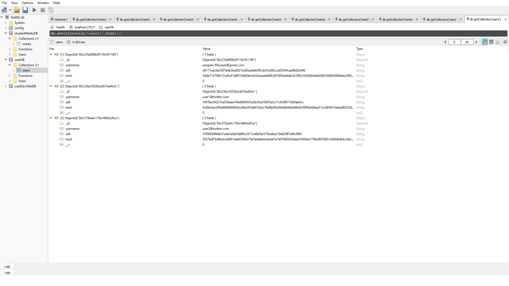

# ScaleModel-for-student-Marks-management-project
A scalabale express application for managing student results using mongo-DB database.

Basic functionality implemented.
The application can be divided into 3-parts:
1. User Authentication
2. Storing and Rendering Student Marks data from Database
3. Adding Admin User to create, edit or delete student data from database

1. User Authentication:
User Authentication includes letting the users/clients to register or login to the application. Currently, registering and logging in yield the same result, i.e. the client is redirected to the list page where all the student marks are listed in tables. In the backend, every time a new user registers with a new email id the Users Database is updated to accomodate and record the new user.
Many large and small companies still commit the crime of storing there clients' passwords in plaintext in there database. A recent list of companies involved in such malicious activities even include the free music webapp Hungama. More can be found in https://plaintextoffenders.com/.
This small scale prototype application however uses salted hashing techniques to store its users' passwords. This is done using an authentication middleware called "Passport.js". This express application uses the Passport-Local-Authenticate strategy-which authenticates the users using a username and password. Passport automatically hashes our password using the pbkdf2 algorithm of the node crypto library.
This is how the users database looks:

