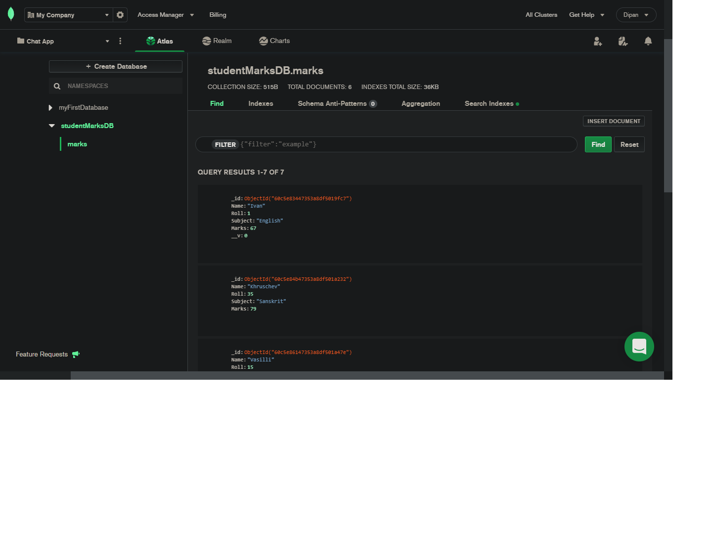

# ScaleModel-for-student-Marks-management-project
A scalabale Express application for managing student results using mongo-DB database in node.js.
## Technologies used in this project:-
### Frontend Technologies: 
Most of the front-end technologies are plain old HTML and CSS. HTML files are templated using EJS(Embedded Java Script) between them.
A Powerful CSS framework-Bootstrap has been used that is used by every modern websites to render modern sleek styles - it was developed by twitter to cut down development time as Vanilla CSS is too time consuming to use. Bootstrap version 5.0 is the latest current version: https://getbootstrap.com/docs/5.0/getting-started/introduction/ 
### Backend Technologies: 
###### Introducing Node:-
Node.js is an open-source, cross-platform runtime environment that allows developers to create all kinds of server-side tools and applications in JavaScript. The runtime is intended for use outside of a browser context (i.e. running directly on a computer or server OS). As such, the environment omits browser-specific JavaScript APIs and adds support for more traditional OS APIs including HTTP and file system libraries. Node was designed to optimize throughput and scalability in web applications and is a good solution for many common web-development problems (e.g. real-time web applications). That is the primary reason why most modern companies use node as their staple server side scripts, as former alternatives such as PHP are being entirely taken over by node.
Code is written in "plain old JavaScript", which means that less time is spent dealing with "context shift" between languages when you're writing both client-side and server-side code.
Visit the official node documentation for more details and implementations of node.js: https://nodejs.org/en/docs/.

###### What is Express:-
Express is a minimal and flexible Node.js web application framework that provides a robust set of features for web and mobile applications. It was released as free and open-source software under the MIT License. It is designed for building web applications and APIs. It has been called the de facto standard server framework for Node.js.  Node.js is a low-level I/O mechanism which has an HTTP module. If you just use an HTTP module, a lot of work like parsing the payload, cookies, storing sessions (in memory or in Redis), selecting the right route pattern based on regular expressions will have to be re-implemented. With Express.js, it is just there for you to use. Official documentation for express.js: https://expressjs.com/

###### MongoDB Database:-
MongoDB is an open-source document database and leading NoSQL database. MongoDB is written in C++. MongoDB is a source-available cross-platform document-oriented database program. Classified as a NoSQL database program, MongoDB uses JSON-like documents with optional schemas. MongoDB is developed by MongoDB Inc. and licensed under the Server Side Public License. MongoDB is a very popular database especially working with node.js and cloud storage. MongoDB can be used as a cloud service using mongoDB Atlas-which enables us to create data clusters in cloud to store out data instead of using a local machine to work with. MongoDB Atlas is an extrememly popular and easy to use service and it is what has been used to store our own data. 
This is how data looks like in MongoDB Atlas:

###### About APIs and RESTful APIs:-
An application program interface (API) is a set of routines, protocols, and tools for building software applications. Basically, an API specifies how software components should interact. Additionally, APIs are used when programming graphical user interface (GUI) components. It is a set of definitions and protocols for building and integrating application software. It’s sometimes referred to as a contract between an information provider and an information user—establishing the content required from the consumer (the call) and the content required by the producer (the response). For example, the API design for a weather service could specify that the user supply a zip code and that the producer reply with a 2-part answer, the first being the high temperature, and the second being the low. A good API makes it easier to develop a program by providing all the building blocks. A programmer then puts the blocks together. 
A REST API (also known as RESTful API) is an application programming interface (API or web API) that conforms to the constraints of REST architectural style and allows for interaction with RESTful web services. REST stands for representational state transfer.
To handle client requests and server responses, we are essentially following the REST API protocols to handle all interactions, much of our server side code is dedicated to building a RESTful API from scratch. We are using it to handle all interactions the server is going to make with the users or clients to share the resources and information while maintaining security and authentication, even determining who gets access to what.

###### Basic functionality implemented.
The server side/backend logic for the application can be divided into 3-parts:
1. User Authentication
2. Storing and Rendering Student Marks data from Database
3. Adding Admin User to create, edit or delete student data from database

###### User Authentication:

User authentication verifies the identity of a user attempting to gain access to a network or computing resource by authorizing a human-to-machine transfer of credentials during interactions on a network to confirm a user's authenticity.
Authentication helps ensure only authorized users can gain access to a system by preventing unauthorized users from gaining access and potentially damaging systems, stealing information or causing other problems. Almost all human-to-computer interactions -- other than guest and automatically logged-in accounts -- perform a user authentication. It authorizes access on both wired and wireless networks to enable access to networked and internet-connected systems and resources.

Many large and small companies still commit the crime of storing there clients' passwords in plaintext format in their database.

This small scale prototype application however uses salted hashing techniques to store its users' passwords. This is done using an authentication middleware called "Passport.js". This express application uses the Passport-Local-Authenticate strategy-which authenticates the users using a username and password. Passport automatically hashes our password using the pbkdf2 algorithm of the node crypto library.
Three pieces need to be configured to use Passport for authentication: 

* Authentication strategies
* Application middleware
* Sessions (optional)

Passport uses what are termed strategies to authenticate requests. Strategies range from verifying a username and password, delegated authentication using OAuth or federated authentication using OpenID. Before asking Passport to authenticate a request, the strategy (or strategies) used by an application must be configured. In this case, passport-local strategy has been used to authneticate requests. The local authentication strategy authenticates users using a username and password. The strategy requires a verify callback, which accepts these credentials and calls done providing a user. 

To learn more about Passport strategies, visit the official documentation at http://www.passportjs.org/. To learn more about passport-local strategy configuration, visit http://www.passportjs.org/packages/passport-local/.

Resources:
1. https://developer.mozilla.org/en-US/docs/Learn/Server-side/Express_Nodejs/Introduction
2. https://stackoverflow.com/questions/12616153/what-is-express-js
3. https://searchsecurity.techtarget.com/definition/user-authentication
4. https://www.mongodb.com/cloud/atlas/lp/try2-in?utm_source=google&utm_campaign=gs_apac_india_search_core_brand_atlas_desktop&utm_term=mongo%20db&utm_medium=cpc_paid_search&utm_ad=e&utm_ad_campaign_id=12212624347&gclid=CjwKCAjwq7aGBhADEiwA6uGZp2bSXhZSoayJi1yIiFen4RtlOku1om8Q-U4zHNbfHeHGs4vGHqELkBoCesIQAvD_BwE
5. https://www.mongodb.com/
6. https://www.redhat.com/en/topics/api/what-is-a-rest-api